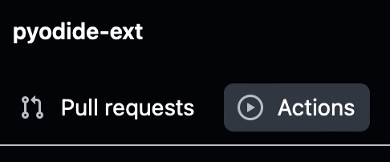
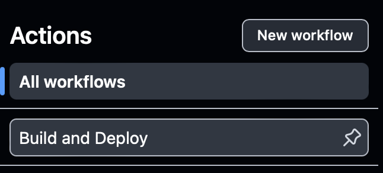
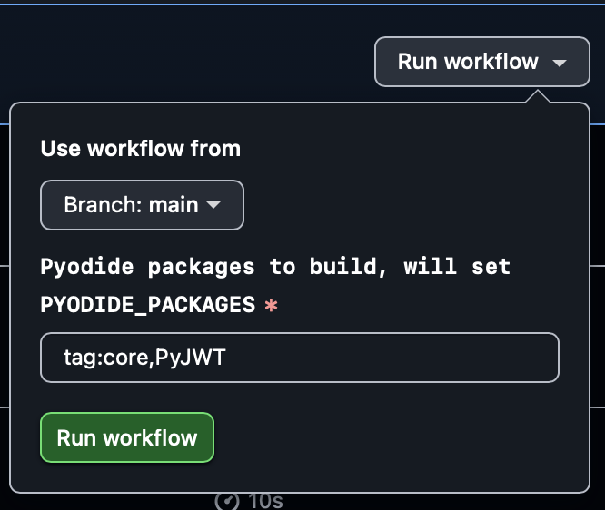
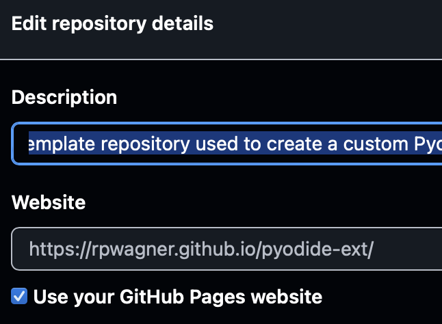
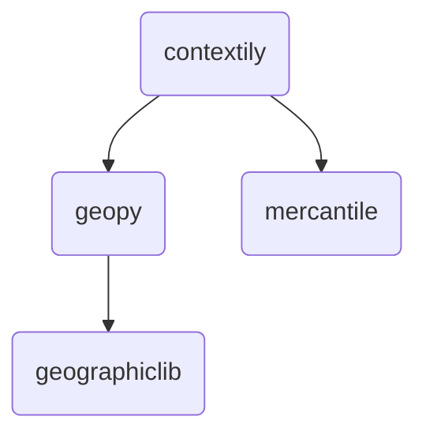
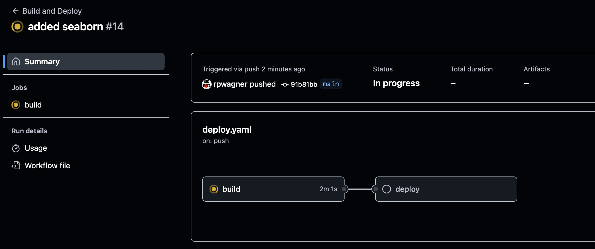

# `pyodide-ext`: Extending Pyodide

This is a [template repository](https://docs.github.com/en/repositories/creating-and-managing-repositories/creating-a-repository-from-a-template) used to create a custom [Pyodide](https://pyodide.org/) distribution with additional packages. The motivation for this is to build interactive [JupyterLite](http://jupyterlite.readthedocs.io/) sites, but this distribution can be used for whatever you need.

The base Pyodide distribution [includes over 250 pacakges](https://pyodide.org/en/stable/usage/packages-in-pyodide.html) beyond those in the [Python Standard Library](https://docs.python.org/3/library/index.html). However, your project may need packages that aren't yet available, and this repository and its documentation can help you get things working in Pyodide. 

TODO: Mention something about being able to do this wihtin the free level of GitHub usage and the scaling available from GitHub Pages.

This repository uses its Build and Deploy GitHub Actions workflow ([`deploy.yaml`](.github/workflows/deploy.yaml)  to build a custom Pyodide distribution by cloning the latest stable version of Pyodide, adding in the additional package definition files from this repository, building the required packages, and deploying the resulting Pyodide distribution to GitHub Pages. By default, the workflow only builds the [minimum required Pyodide packages](https://pyodide.org/en/stable/development/building-from-sources.html#partial-builds) (`tag:core`), plus the ones defined in this repository. You can update [`deploy.yaml`](.github/workflows/deploy.yaml) to build additional packages by default (e.g., `tag:min-scipy-stack`).

The [`deploy.yaml`](.github/workflows/deploy.yaml) workflow definition file is derived from the Pyodide [`main`](https://github.com/pyodide/pyodide/blob/main/.github/workflows/main.yml) workflow, and currently this template is pinned Pyodide version 0.27.5. You can verify this by checking around [line 35 of `deploy.yaml`](.github/workflows/deploy.yaml#L35):
```yaml
      - uses: actions/checkout@v4
        with:
          repository: 'pyodide/pyodide'
          ref: '0.27.5'
          submodules: 'recursive'
```
The workflow may need be modified for future Pyodide releases.

Outline:

1. [Generating a New Repository](#generating-a-new-repository)
1. [Configure and Build GitHub Pages](#configure-and-build-github-pages)
1. [Adding Packages](#adding-packages)
    1. [Example: PyJWT](#example-pyjwt)
    1. [Adding Packages Using `pyodide-build`](#adding-packages-using-pyodide-build)
1. [Testing the Pyodide Distribution](#testing-the-pyodide-distribution)
1. [Using the Pyodide Distribution](#using-the-pyodide-distribution)

## Generating a New Repository

These instructions apply to [`https://github.com/rpwagner/pyodide-ext`](https://github.com/rpwagner/pyodide-ext). If this is a repository generated from the original, it may not be a template, so you will need to fork it or clone it to reuse it. To generate your own repository based on this one, you can follow [GitHub's instructions](https://docs.github.com/en/repositories/creating-and-managing-repositories/creating-a-repository-from-a-template#creating-a-repository-from-a-template).

Some notes:
- Make sure you create your new repository under an account (likely your personal one) where you can enable GitHub Pages.
- You can give your new repository a different name. These instructions will assume that you named it `pyodide-ext`.

## Configure and Build GitHub Pages

This repository uses a [GitHub Actions workflow](https://docs.github.com/en/actions/writing-workflows/about-workflows) to build a Pyodide distribution and to deploy that distribution to GitHub Pages. First, follow the GitHub instructions to enable [building the distribution using the GitHub Actions workflow](https://docs.github.com/en/pages/getting-started-with-github-pages/configuring-a-publishing-source-for-your-github-pages-site#publishing-with-a-custom-github-actions-workflow) on your new repository.

---

After you enable this, go to the "Actions" tab on your repository:



---

Click on the "Build and Deploy" button below the list of "All workflows":



---

On the right, click on the "Run workflow" button, and in the dropdown, click on the the next "Run workflow" button. You don't need to change any of the settings at this time.



---

The build process will take about 15 minutes. You can monitor the status by looking at the workflow run under the "Actions" tab. This build process will happen every time you make a commit to your repository, either directly or via a pull request. Sometimes you don't want to cause another build to happen and you can [cancel the workflow](https://docs.github.com/en/actions/managing-workflow-runs-and-deployments/managing-workflow-runs/canceling-a-workflow).

If you look into the build logs for the workflow run, you can the list of packages being built under the `build Pyodide with packages` step. Since this is the first build, it represents the packages built as part of the `tag:core` list, plus PyJWT.
```
Building the following packages: Jinja2, MarkupSafe, PyJWT, atomicwrites, attrs,
buffer-test, cffi, cpp-exceptions-test, cpp-exceptions-test2, cryptography,     
exceptiongroup, fpcast-test, hashlib, iniconfig, liblzma, lzma, micropip,       
more-itertools, openssl, packaging, pluggy, py, pycparser, pydecimal,           
pydoc_data, pyparsing, pytest, pytest-asyncio, pytz, regex, setuptools,         
sharedlib-test, sharedlib-test-py, six, sqlite3, ssl, tblib, and test
```

Once the workflow completes, you can test the distribution by going to your GitHub Pages site at: `https://{github-username}.github.io/pyodide-ext/`. There will be a landing page with a link to the Pyodide REPL console for your new distribution.

---

You might find it convenient to add a link to your GitHub Pages site to your repository's main page. You can do this by clicking on the "About" setting on the main page:


And then checking the box "Use your GitHub Pages website".



## Adding Packages

Pyodide packages are [defined by `meta.yaml` files](https://pyodide.org/en/stable/development/new-packages.html#creating-the-meta-yaml-file) that proivde URLs for the source code, lists of dependencies, build instructions, etc. For basic pure-Python packages, these files can be fairly minimal and [created programmatically](https://pyodide.org/en/stable/development/meta-yaml.html#meta-yaml-spec).  

One complication to keep in mind is that you will need to add all of the dependencies for your package, except for those in the [Python Standard Library](https://docs.python.org/3/library/index.html) or already [included with Pyodide](https://pyodide.org/en/stable/usage/packages-in-pyodide.html). The `finddeps.py` script described below can help identify the needed dependencies.

The Pyodide documentation has detailed instructions on [how to add packages](https://pyodide.org/en/stable/development/new-packages.html). This also includes the best recommendation, which is to look at packages that have already been ported to Pyodide in [the main repoistory's packages folder](https://github.com/pyodide/pyodide/tree/main/packages). The method used in this this repository is not the only way to add packages (see the [Pyodide "Loading packages" documentation](https://pyodide.org/en/stable/usage/loading-packages.html)). You can directly install many packages using `micropip.install()`, or build packages in or out of the main Pyodide tree. The approach in this repository is to avoid using `micropip.install()` so that Jupyter notebooks and Python modules can remain portable without needing to check the runtime environment. However, you may find it easier to develop and test the build process for a given package and its dependencies by using a local development process and then adding the package definition (`meta.yaml`, patches, etc.) into this repository when it's working as expected.

Adding a new package and rebuilding the distribution uses these steps:
1. Define a new package by creating a new `meta.yaml` file in [`packages`](./packages), under `packages/{package-name}/meta.yaml`.
1. Add any patch files or tests under `packages/{package-name}/`, making sure they're referenced in `meta.yaml`.
1. Update the Build and Deploy workflow to include the new package in the default build.
1. Commit the new package and updated workflow file to the repository.
1. Monitor the workflow run's progress and build status.
1. Test the updated Pyodide distribution. ([jump to section](#testing-the-pyodide-distribution)

### Example: PyJWT

A `meta.yaml` definition file for [PyJWT](https://pyjwt.readthedocs.io/en/stable/) is included in this repository at [`packages/PyJWT/meta.yaml`](packages/PyJWT/meta.yaml). Here is the file's contents:

```yaml
package:
  name: PyJWT
  version: 2.10.1
  top-level:
    - jwt

source:
  url: https://files.pythonhosted.org/packages/py3/p/pyjwt/PyJWT-2.10.1-py3-none-any.whl
  sha256: dcdd193e30abefd5debf142f9adfcdd2b58004e644f25406ffaebd50bd98dacb

requirements:
  run:
    - cryptography
    - ssl

about:
  home: https://github.com/jpadilla/pyjwt
  PyPI: https://pypi.org/project/PyJWT
  summary: JSON Web Token implementation in Python
  license: MIT

extra:
  recipe-maintainers:
    - rpwagner
```

As mentioned above, these `meta.yaml` follow a [specification](https://pyodide.org/en/stable/development/meta-yaml.html#meta-yaml-spec) which is based on the Conda packaging specification. Below, you'll see a basic version can be created programmatically, and which may be sufficient for many packages. Looking in the [`deploy.yaml`](.github/workflows/deploy.yaml) file you will see a couple of places with the text `'tag:core,PyJWT'`, which will tell the Pyodide build process to add PyJWT to the list of packages. The requirements list in the `meta.yaml` definition also ensure that the necessary dependencies also get built.

### Adding Packages Using `pyodide-build`

Clone your repository and change into its directory

```shell
$ git clone https://github.com/{github-username}/pyodide-ext.git
$ cd pyodide-ext
```

---

Create a virtual Python environment. This is not strictly necessary, just a recommended practice.

```shell
$ python -m venv venv
$ source venv/bin/activate
(venv) $
```

---

Install `pyodide-build` and other requirement.

```shell
(venv) $ pip install -r requirements.txt
```

---

Check whether or not you need to build any additional packages. The script `finddeps.py` will list all of the dependendencies for a given package that aren't available in Pyodide or the Python Standard Library. *N.B.* The script is extremely basic and does not check the dependencies of any extras. This may miss packages necessary for building or the feature you're interested in.

You call the script via: `./finddeps.py {package-name}`.

For example, here is the result for the [Seaborn](https://seaborn.pydata.org) data visualization library.
```shell
(venv) $ ./finddeps.py seaborn
{'seaborn': set()}

```

`finddeps.py` prints out a JSON dictionary, where each key is a package name and the values are sets of package names of the dependencies for the given key. In this case, all of Seaborn's required dependencies (`numpy`, `pandas`, and `matplotlib`) are already available in Pyodide. 


If we look at `contextily`, a Python tool for retrieving tile maps, we find there are several additional packages we would need to define and build before we could use `contextily` in Pyodide.
```shell
(venv) $ ./finddeps.py contextily
{'contextily': {'geopy', 'mercantile'},
 'geographiclib': set(),
 'geopy': {'geographiclib'},
 'mercantile': set()}
```
Here's a graph representing these dependencies.


In this case, we would need to build `mercantile` and `geographiclib` (we can build them in either order), then `geopy` since it depends on `geographiclib`, before we can build `contextily`. 

---

To get started, we can use the `pyodide-build` tool installed as part of the `requirements.txt` to create a [skeleton yaml file](https://pyodide.org/en/stable/development/new-packages.html#creating-the-meta-yaml-file) for our packages.

```shell
(venv) $ pyodide skeleton pypi <package name>
```

Using Seaborn as the example
```shell
$ pyodide skeleton pypi seaborn       
Creating meta.yaml package for seaborn                                                                                                           
packages/seaborn/meta.yaml 11ms
Output written to /home/username/pyodide-ext/packages/seaborn/meta.yaml
```

This produces this YAML file
```yaml
package:
  name: seaborn
  version: 0.13.2
  top-level:
    - seaborn
source:
  url: https://files.pythonhosted.org/packages/py3/s/seaborn/seaborn-0.13.2-py3-none-any.whl
  sha256: 636f8336facf092165e27924f223d3c62ca560b1f2bb5dff7ab7fad265361987
about:
  home: null
  PyPI: https://pypi.org/project/seaborn
  summary: Statistical data visualization
  license: null
extra:
  recipe-maintainers:
    - PUT_YOUR_GITHUB_USERNAME_HERE
```

Looking at the Seaborn source code, we can fill in a few things. Most importantly, the run time dependencies. Specifying these ensures that they will be built if Seaborn is requested, and they will be loaded (and [installed](https://pyodide.org/en/stable/usage/loading-packages.html#loading-packages)) when Seaborn is imported.
```yaml
package:
  name: seaborn
  version: 0.13.2
  top-level:
    - seaborn
source:
  url: https://files.pythonhosted.org/packages/py3/s/seaborn/seaborn-0.13.2-py3-none-any.whl
  sha256: 636f8336facf092165e27924f223d3c62ca560b1f2bb5dff7ab7fad265361987
requirements:
  run:
    - numpy
    - pandas
    - matplotlib
about:
  home: https://seaborn.pydata.org
  PyPI: https://pypi.org/project/seaborn
  summary: Statistical data visualization
  license: BSD-3-Clause
extra:
  recipe-maintainers:
    - {github-username}
```

Seaborn has extras, so anything provided by its [optional dependencies](https://seaborn.pydata.org/installing.html#optional-dependencies) won't be available unless those packages are loaded by another route.

---

Now that the new package is defined, it needs to be added to the list of default packages to build. There are two places in [`deploy.yaml`](./.github/workflows/deploy.yaml) where the defualt is defined, the dispatch input and the environment. (This needs to be improved and provide a single point of truth.)
```yaml
  workflow_dispatch:
    inputs:
      pyodide_packages:
        description: 'Pyodide packages to build, will set PYODIDE_PACKAGES'
        required: true
        default: 'tag:core,PyJWT'
        type: string
...
    env:
      EMSDK_NUM_CORES: 2
      EMCC_CORES: 2
      PYODIDE_JOBS: 2
      CCACHE_DIR: /tmp/ccache
      PYODIDE_PACKAGES: ${{ inputs.pyodide_packages || 'tag:core,PyJWT' }}
```

This file needs to update this to add Seaborn alongside PyJWT.
```yaml
  workflow_dispatch:
    inputs:
      pyodide_packages:
        description: 'Pyodide packages to build, will set PYODIDE_PACKAGES'
        required: true
        default: 'tag:core,PyJWT,seaborn'
        type: string
...
    env:
      EMSDK_NUM_CORES: 2
      EMCC_CORES: 2
      PYODIDE_JOBS: 2
      CCACHE_DIR: /tmp/ccache
      PYODIDE_PACKAGES: ${{ inputs.pyodide_packages || 'tag:core,PyJWT,seaborn' }}
```

---

At this point, the changes can be added, committed, and pushed to the repository
```shell
(venv) $ git add packages/seaborn/meta.yaml .github/workflows/deploy.yaml
(venv) $ git commit -m 'added seaborn'
(venv) $ git push origin main
```

This will trigger a build, which can be monitored by going to the Actions tab and clicking on the "added seaborn" workflow run.



Looking at the workflow logs under the `build Pyodide with packages` step we can see that `numpy`, `matplotlib`, and `pandas` are now included in the build, in addition to Seaborn. These new packages will add quite a bit to the build time.
```
Building the following packages: Jinja2, MarkupSafe, Pillow, PyJWT,             
atomicwrites, attrs, buffer-test, cffi, contourpy, cpp-exceptions-test,         
cpp-exceptions-test2, cryptography, cycler, exceptiongroup, fonttools,          
fpcast-test, hashlib, iniconfig, kiwisolver, liblzma, libtiff, libwebp, lzma,   
matplotlib, matplotlib-pyodide, micropip, more-itertools, numpy, openssl,       
packaging, pandas, pluggy, py, pycparser, pydecimal, pydoc_data, pyparsing,     
pytest, pytest-asyncio, python-dateutil, pytz, regex, seaborn, setuptools,      
sharedlib-test, sharedlib-test-py, six, sqlite3, ssl, tblib, and test
```

## Testing the Pyodide Distribution

Test the build in the REPL console at: `https://{github-username}.github.io/pyodide-ext/console.html`. May need to clear your website data reguarly, in case the REPL files are being cached in your browser.

At a minimum, import the package to ensure the dependencies are declared correctly.

```python
Welcome to the Pyodide 0.27.5 terminal emulator 🐍
Python 3.12.7 (main, May  5 2025 08:30:39) on WebAssembly/Emscripten
Type "help", "copyright", "credits" or "license" for more information.
>>> import seaborn
Matplotlib is building the font cache; this may take a moment.
>>> 
```
Everything loads correctly. When this distribution is used in a JupyterLite site, the plotting capabilities of Seaborn can be tested.


## Using the Pyodide Distribution

The Pyodide documentation describes [how to use Pyodide](https://pyodide.org/en/stable/usage/index.html) in a web browser or environments like Node.js. For those use cases and to [use it in JupyterLite](https://jupyterlite.readthedocs.io/en/stable/howto/pyodide/pyodide.html#using-a-custom-pyodide-distribution), you will usually point to the `pyodide.js` file in the distribution. This can be fund at:

`https://{github-username}.github.io/pyodide-ext/pyodide.js`
